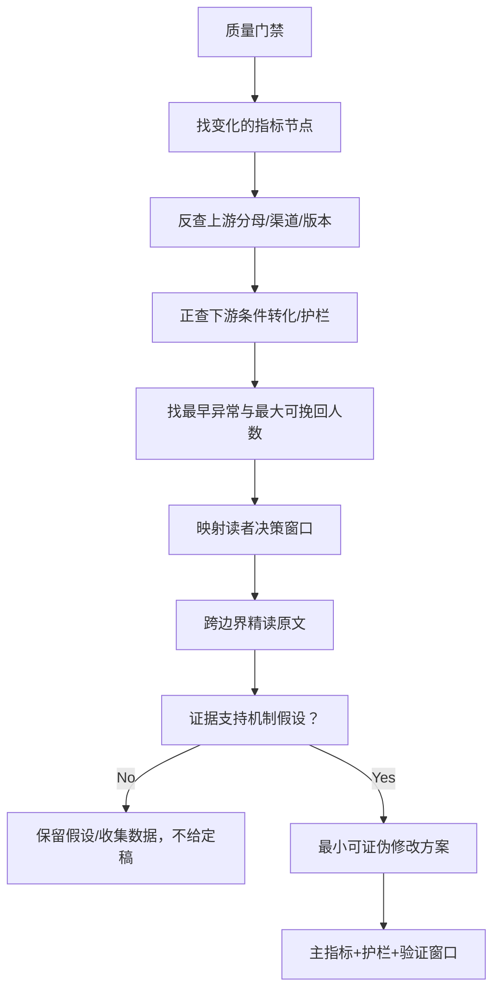

# 指标异动下钻与改文路由 v1

> 机器可读权威：`../dictionary/diagnostic-routes.v1.json`。共 **25 条路由**。本文是人工阅读版。

下文出现的“绝对人数”“绝对损失”“样本量”，只允许来自平台直接人数或有明确权威 cohort 的同口径复算。若平台只展示百分比，只分析比率与百分点；由百分比求出的最小兼容整数只是非权威下界，不能跨快照相减，也不能充当显著性或样本门槛的分母。

## 1. 正确顺序：不是“看到低指标就改文”



## 2. 指标变化时必须联查什么

| 起始异动 | 必须反查/正查 | 首要候选问题 | 可直接改动位置 | 禁止推断 |
|---|---|---|---|---|
| 长篇日阅读人数 | 渠道人数/占比、渠道合计差、在读14日、自访风险 | 分发机会、渠道换血、更新/推荐阶段 | 先无正文位置 | 不得说曝光、CTR或正文质量变化 |
| 长篇在读14日 | 日阅读序列、继续阅读、追更、最新章到达 | 新日进入与最旧日滚出合成、回访价值 | 最新剧情单元（归因门通过后） | 不得称精确新增/流失 |
| 长篇渠道结构 | 日阅读、搜索占比、同渠道转化（若有） | 读者换血、单渠道依赖 | 标签/包装只能作间接假设 | 不得从渠道阅读反推渠道曝光/转化 |
| 搜索占主导 | 作者/熟人访问确认、搜索绝对人数 | 自访污染或真实精确搜索 | 确认前不改文归因 | 不得默认全部搜索都假，也不得归因文本 |
| 1→2 | A1/A2绝对人数、平台follow同步、渠道、版本、2→3护栏 | 首屏未落地、主角无选择、章内无小兑现、第2章撤回承诺 | 书名/简介，第1章全文与章末，第2章标题/开头 | 不得说只是第1章最后一句 |
| 2→3 | A2/A3、1→2、3→4、版本 | 重复第1章说明、核心机制不运转、第3章冷启动 | 第1–3章，重点第2章结果/代价与第3章入口 | 不得仅由 A3/A2 说第3章整章差 |
| 3→4 | 前三章保留、4→5、深度到达 | 小事件结束后无长期目标、第4章像另一本书 | 第3章兑现+新问题，第4章承接 | 不得用一句假悬崖替代单元目标 |
| N→N+1 | 绝对损失、同步到达、N+1→N+2、单元深度、版本 | 无信息/状态增量、承诺欠账、重复冲突、假卡点/撤回、单元真空 | N章全文、章末、N+1标题/开头、完整剧情单元 | 不得把小分母最大跌幅当真实断点 |
| 深章到达 | 前三章、各转移、单元锚点、追更 | 核心卖点偏移、兑现周期太长、高潮后真空、支线占据 | 异常区间前后各2章+完整单元 | 不得在前三章漏空时归罪后章 |
| 加书架 | 日阅读、代理率、前三章、渠道、追更 | 长期价值不可见、一次性噡头、人物陪伴价值弱 | 简介的长期收益、前三章、阶段兑现后的下一目标 | 不得称净增书架/官方转化/算法权重 |
| 追更/继续阅读 | 最新章到达、近7日更新、在读14日、催更 | 更新不稳、最新单元无进展、无可信下一目标 | 最近7日章节、当前单元兑现、下次更新价值 | 不得把追更当订阅总人数 |
| 催更 | 最新章到达、追更、更新间隔 | 合格人群变化、下一步不重要、过度圆满 | 最新章兑现、章末的具体行动/期限/代价 | 最新章无到达时，催更0无文本诊断意义 |
| 评论/评分 | 日阅读、评论文本/位置、评分人数（若有） | 流量规模、正向情绪峰值、逻辑/人设抱怨、删评 | 只改读者反复指向的具体场景/决策 | 不得由数量猜情感正负 |
| 短故事展示 | 阅读、点击率、sign/投稿状态、口径 | 分发机会、资格/标签、统计范围 | 先无正文位置 | 不得以展示低重写整篇 |
| 短故事点击率 | 展示/阅读人数、15秒承接、绝对损失 | 标题/封面不清、题材读者错配、包装过度承诺 | 标题、封面、导语、首屏与前300字对齐 | 不得诊断中段/结尾 |
| 阅读→15秒 | 点击、阅读人数、15→30、损失人数 | 承诺未落地、背景热身、谁/正在发生什么不清 | 开头至约前300字 | 不得说某一句是退出点 |
| 15→30秒 | 阅读→15、30→60、绝对损失 | 有钩子无目标/对手、信息增量停滞、重复震惊 | 从开头通读，重点约300–1000字 | 不得只改估计第15秒附近的一句 |
| 30→60秒 | 15→30、60→触底、绝对损失 | 冲突不升级、证据/解释重复、首次兑现太迟 | 从开头通读，重点约500–2000字 | 不得乱加反转骗时长 |
| 60秒→触底 | 30→60、整体触底、损失人数 | 中段程序/证据/惩罚链重复、主角失去主动、反转/结尾未兑现 | 约2000字后到结尾完整单元 | 不得说只是最后一段 |
| 整体触底率 | 所有条件转化+各级损失+最早异常 | 上游损失传导或多点问题 | 只路由到已通过验证的最早异常窗口 | 不得直接重写整篇/结尾 |

## 3. 如何从指标节点下钻到原文

对每个通过门禁的异动，改进 Agent 必须交付一张证据卡：

```yaml
metric_node: 指标ID + 维度值
official_definition: 官方口径或明示内部派生
observed_change:
  baseline_fact: metric_id + 完整 dimensions；必须唯一命中冻结事实
  current_fact: metric_id + 完整 dimensions；必须唯一命中冻结事实
  baseline: 必须等于 baseline_fact.value
  latest: 必须等于 current_fact.value
  delta: current - baseline；带符号并保留原单位
  effect_size: 与可复算 delta 相同；不得手填另一口径
  direction: 由 delta 机械推导 UP / DOWN / FLAT
reader_decision: 读者在此决定什么
text_window: 必读边界
source_evidence:
  - file: 绝对或项目相对路径
    location: 章节/段落/行号
    observed_problem: 不作价值判断的文本事实
primary_mechanism_hypothesis: 文本事实如何增加理解/情绪/期待阻力
alternatives: 渠道、版本、更新、样本等替代解释
minimal_change: 最小可证伪改动，不是直接给正文定稿
mechanism_chain: 改动 -> 中间机制 -> 主指标
primary_metric: 一个
guardrail_metrics: 至少一个下游/诚信护栏
next_validation_window: 首个完整生效日 + 预先窗口
confidence: low | medium | high
```

原文证据必须是可观测的，例如：

- 第1章结尾提出“木桶即将升起”，第2章开头却用多段回忆推迟了木桶内容。
- 短故事前1000字内连续三次重述同一借贷风险，但主角直到第四次才作出可见行动。

“钩子不够强”、“节奏不行”、“情绪不够”不是可验证文本证据。

## 4. 修改想法必须写完的逻辑链

```text
原文中可观测的问题
→ 它造成的读者理解/情绪/期待阻力
→ 为什么该阻力正好影响这个漏斗节点
→ 最小修改改变什么中间机制
→ 哪个主指标应该先变
→ 哪些下游指标/逻辑诚信不得恶化
```

如果这条链中有一个箭头只能用“感觉”解释，则方案仍是待验证假设，不得进入“已定位、改后会提升”的结论。

## 5. 最小改动与护栏

- 包装变量：一次优先只测书名/封面/简介中一个主变量，并以1→2或15秒承接为诚信护栏。
- 跨章变量：先修复本章价值、章末未决行动和下章立即承接；护栏是下一转移、人设/规则连续性与“骗卡点”负反馈。
- 多章变量：只在连续衰减和单元证据一致时压缩整个单元；护栏是单元高潮、伏笔、角色动机和后3–5章到达。
- 短故事中后段：删的是无新状态的重复程序/证据/惩罚，不是粗暴缩字数；护栏是因果链完整、反转有铺垫和结尾情感账结清。

## 6. 必须停止的情况

- `data_until` 未达到预期或同截止日仍在回填。
- 改动尚未进入数据窗口。
- `published_at` 转为 `Asia/Shanghai` 后，最新 `data_until` 只能机械落入 `NOT_COVERED / PARTIAL_DAY_COVERED / FULL_DAY_COVERED`：本地发布日期为 first covered；除本地 `00:00:00` 发布外，下一日才是 first full。部分日覆盖不能冒充完整日验证，覆盖状态也不能替代线上版本证据。
- 可比口径不一致，例如累计去重和多日求和直接对比。
- 合格样本分母不可从冻结源权威复算时，必须用 `sample_size_qualified=false + sample_size=0 + sample_metric_id=UNAVAILABLE` 表示“样本不可用”，并记录原因；这个 0 不是实际零读者。不得拿其他资格人群或百分比反推的最小兼容下界代替样本。
- 权威分母真实为0或小于30。可进行文本假设检查，但结论必须是“样本不足”，不能声称已定位真实流失原因；样本不可用或小于30时异常阈值不得标 `TRIGGERED`。
- 搜索主导且未确认自访/熟人访问。
- 平台 `follow` 与同快照到达人数不同步。
- 下一章未发布或发布窗口过短。
