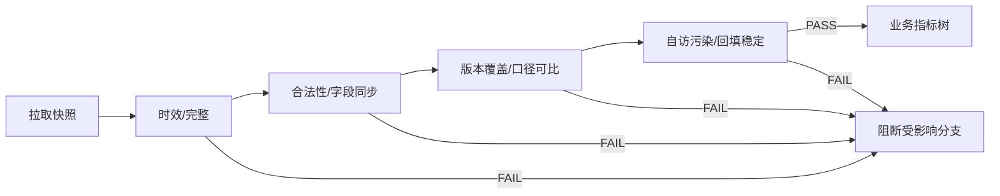

# 长篇/短故事数据分析指标体系 v1

> 机器可读权威：`../dictionary/metrics.v1.json` 与 `../dictionary/metric-tree.v1.json`。本文只解释如何使用，不在 Markdown 中维护另一份口径。

## 1. 盘点结果

当前共 **56 个指标家族**：

| 范围 | 指标家族数 | 分块数 | 分块与数量 |
|---|---:|---:|---|
| 数据质量 | 12 | 9 | freshness 1、completeness 2、consistency 1、contamination 1、stability 1、synchronization 1、validity 3、versioning 1、comparability 1 |
| 长篇小说 | 29 | 10 | distribution 6、packaging 1、activation_depth 5、golden_three 2、depth 3、depth_quality 1、depth_return 1、return 1、engagement_return 8、active_scale 1 |
| 短故事 | 15 | 5 | distribution 1、packaging 3、opening_activation 6、completion 3、funnel_diagnostics 2 |

这里计数的是 **metric family**，不是页面上出现的所有数字。`channel`、`chapter_index`、`story_id`、`period` 是维度；书城、分类、书架、继续阅读、搜索、其他是 `channel` 的成员，只对应一个 `long_channel_readers` 指标家族。不将六个渠道数字冒充六个指标。

## 2. 什么才算一个完整指标

每个指标都必须有语义签名：

```text
对象
+ 事件/状态
+ 度量
+ 固定限定
+ 时间粒度/窗口
+ 聚合方式
+ 单位
```

例如“在读人数”不能只记一个名字，完整签名是：

```text
长篇作品读者
+ 最近14日内听或读过本书
+ 去重用户数
+ 指定 work_id
+ rolling 14 day
+ 窗口去重
+ 人
```

所以：

- 相邻两日的在读差，不是“今日新增减今日流失”的可观测拆分。
- 短故事的“累计”和“7/14/30日每日值求和”去重口径不同，不能直接相减成新增用户。
- 追更、催更、加书架的资格人群不同，不得统一除以“在读人数”后冒充官方转化率。

## 3. 维度与指标的分界

| 类型 | 例子 | 用法 |
|---|---|---|
| 度量 metric | 日阅读人数、章节到达人数、30→60秒承接率 | 被监控、建基线、判断异动 |
| 维度 dimension | channel、chapter_index、period、chapter_version | 切片、对齐口径、拆分差异 |
| 维度成员 member | 搜索、第1章、累计 | 维度下的具体取值，不是新指标 |
| 诊断代理 proxy | 加书架/日阅读 | 只用来规模归一，每次明示“不是官方转化率” |
| 质量门 quality | 版本覆盖状态、字段不同步数 | 决定业务分支能否进入归因 |

## 4. 指标树

### 4.1 先过数据质量树



质量门失败的合法结论是“平台未更新”、“数据未覆盖改动”、“口径不可比”或“样本受自访污染”，不是对正文质量的判决。

### 4.2 长篇树：分发 → 包装 → 黄金三章 → 深度 → 回访互动 → 活跃规模


长篇根节点没有总公式。原因是各分支分母与窗口不同：日阅读是单日听+读用户，章节到达是累计快照，追更是最近7日更新章的有效读者，在读是14日去重滚动窗。把它们相乘只会造出假精确综合分。

黄金三章在同 cohort、同步、未舍入条件下有：

```text
A4/A1 = (A2/A1) × (A3/A2) × (A4/A3)
```

因此先找最早异常转移，不把 A4/A1 的下降一概归罪第3章结尾。

### 4.3 短故事树：同口径下可精确乘法分解


```text
触底人数
= 展示人数
× 点击率
× 15秒承接率
× 15→30秒承接率
× 30→60秒承接率
× 60秒后触底率
```

该恒等只在 `story_id + period + platform_scope + data_until` 全部一致，且用原始人数复算时成立。

## 5. 异动不是“今天比昨天大”

一个数值要被标记为可分析异动，按顺序通过六层：

1. **数据质量门**：时效、完整、合法、字段同步、版本覆盖、口径可比。
2. **分母门**：分母必须来自权威人数或明确 cohort，最小兼容下界不算样本；分母为0不可计算，小于30人只报权威人数/率与方向，30–99最多方向性，大于等于100仍须过区间和干扰门。
3. **历史基线门**：有14个以上可比点时用中位数/MAD或合适控制限；7–13只做临时提醒；少于7只报绝对变化。
4. **效应量门**：有权威分子/分母时同时报绝对人数差、百分点差、置信区间和预先声明的 MDE；只有展示百分比时报告率与百分点并标明分母不可得。
5. **连续性与多重检验门**：近3个可比点至少2个同向，或两个非重叠窗口同向；全书扫多个章节时要复现或控制 FDR。
6. **上游与护栏门**：先排除规模、渠道、更新、推荐阶段、并发改动，再检查下游护栏是否被换取。

分母门不是“找一个相近人数顶上”。找不到与问题同 cohort、同口径并可从冻结源权威复算的样本时，记录：

```text
sample_size_qualified=false
sample_size=0
sample_size_authoritative=false
sample_aggregation=unavailable
sample_metric_id=UNAVAILABLE
sample_unavailability_reasons=[明确缺失原因]
```

这里的 0 代表“合格样本不可用”，不代表真实读者数为 0。此时可以报告平台直接展示的率和原始计数事实，但总体状态只能是“样本不足”，阈值不能标 `TRIGGERED`，也不得给强结论或因果归因。由百分比反推的 `minimum_compatible_*_lower_bound` 只回答“至少多大的整数 cohort 能与当前舍入展示相容”；它不是最可能人数或人数估算，禁止作为样本、置信区间/MDE 分母、绝对损失、可挽回人数和跨快照增量。

每条异动还必须绑定两条可唯一解析的事实 selector：

```text
baseline_fact = metric_id + 完整 dimensions
current_fact  = metric_id + 完整 dimensions
baseline/current = 对应事实 value
delta = current - baseline
effect_size = 同一带符号、保单位 delta
direction = sign(delta)
```

baseline/current 不能来自手抄摘要；selector 命中 0 条或多条、事实非数值、差值不能复算时，只能修复事实表或维度，不能继续解释异常。validator 必须从冻结 raw/normalized/window 源按 JSON Pointer 和 calculation expression 独立重算全部 facts；复制 metrics artifact 中的结果不算独立复算。

内部稳健计数提醒是：

```text
m   = 可比历史值中位数
MAD = median(|x-m|)
σr  = 1.4826 × MAD

|x_latest-m| > max(3σr, 历史日变化绝对值P95, 2人)
```

这只是“值得调查”，不是番茄官方优秀线或改善/恶化判决。`MAD=0` 时改用 IQR/适合计数分布的控制图，或降级为绝对人数报告，不得除零。

## 6. 哪些指标可以直接对应改文

| 异动节点 | 直接可改位置 | 不能直接改文的情况 |
|---|---|---|
| 长篇展示→阅读（只有分母时） | 书名、封面、简介前1–3句、第1章前200–500字 | 当前只有渠道阅读、没有展示分母 |
| 长篇 N→N+1 | 第N章全文、章末10%–20%、N+1标题与开头200–500字 | 字段不同步、下章未发、分母<30、版本未覆盖 |
| 长篇多章缓降 | 异常区间前后各2章、完整剧情单元、单元细纲 | 前三章已漏空、深章无到达样本 |
| 加书架/追更/催更 | 长期目标、阶段兑现、最新单元、下一步具体目标 | 阅读规模或合格人群为0；更新节奏未分离 |
| 短故事点击率 | 标题、封面、开头导语、首屏承诺 | 只有展示低、点击率无异常 |
| 阅读→15秒 | 开头至约前300字 | 不能精确说某句是离开点 |
| 15→30秒 | 从开头通读，重点约300–1000字 | 不能只截取“第15秒”附近一段 |
| 30→60秒 | 从开头通读，重点约500–2000字 | 不能用无因果随机反转补指标 |
| 60秒→触底 | 约2000字后到结尾的完整剧情单元 | 不能由整体触底低直接说结尾差 |

## 7. 对一次改动的最小完整评估

```text
改动事件：实际上线时间 + 版本 + 主指标 + 护栏 + 并发事件
        ↓
数据覆盖：首次部分覆盖 + 首个完整生效日
        ↓
对比：改前基线 + 前一快照 + 最新快照 + 同长窗口
        ↓
异动：数据质量 → 分母 → 基线/MAD → 效应量/MDE → 连续性 → 上游/护栏
        ↓
文本验证：指标决策窗口 → 原文证据 → 首要与备选机制
        ↓
改文假设：最小可证伪改动 → 中间机制 → 主指标 → 护栏 → 下次可验证日
```

最终状态只能为：`改善 / 恶化 / 无明显变化 / 样本不足 / 数据未覆盖改动 / 样本受自访污染`。观察数据默认只支持相关性和机制假设；没有随机实验或可信准实验，不写“已证明是改文导致”。

这个状态的评估单位是“一次已登记改动”，不是“整本书”。同一 run 有三项改动，就必须有三条独立评估，可以分别是数据未覆盖、样本不足和改善。数值方向与业务好坏方向也必须分开：转化率上升通常是改善，流失人数下降才是改善，状态门和情境型指标不允许仅凭 UP/DOWN 判好坏。权威方向见 `metrics.v1.json.preferred_direction_by_metric`。

窗口覆盖统一按 `Asia/Shanghai` 机械计算：带时区的 `published_at` 转为上海时间后，本地发布日期是 `first_covered_data_date`；仅恰在本地 `00:00:00` 发布时首个完整数据日为同日，否则为次日。最新 `data_until` 早于 first covered 为 `NOT_COVERED`，介于 first covered（含）和 first full（不含）为 `PARTIAL_DAY_COVERED`，达到 first full 为 `FULL_DAY_COVERED`。覆盖状态与线上版本证据是两件事，部分日覆盖不能冒充完整日验证。
